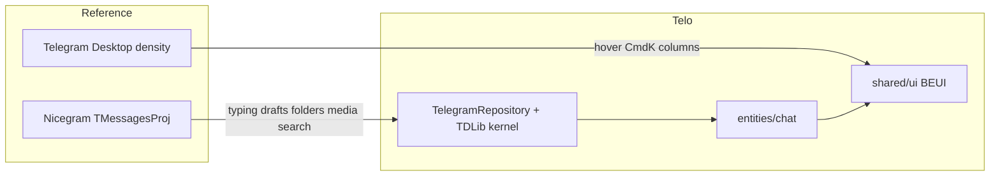

# Nicegram Alignment

Reference sources: [nicegram/Nicegram-Android](https://github.com/nicegram/Nicegram-Android) (`TMessagesProj`, a Telegram-Android fork) and [nicegram/Nicegram-iOS](https://github.com/nicegram/Nicegram-iOS) (`NGTranslate`). This document maps their daily-client behavior onto Telo's gaps in [`gaps.md`](gaps.md) and states what stays out of scope.

## Alignment principles

- **Align the daily-conversation core with Nicegram's underlying Telegram client, not its product line.** Nicegram wraps Telegram-Android/iOS; its own additions (wallet, Stars, NFT, Agent Marketplace, a standalone AI-analysis screen) are a different product. Telo does not copy those. See the "不做" section and Wave 7 in `gaps.md`.
- **Wave 3 (message-level AI) is Telo's differentiator, not Nicegram's.** Nicegram's `AiAnalysisHelper.kt` bundles up to 100 messages and opens a standalone `AiChatAnalysisFragment`. Telo instead writes translate/rewrite/draft results into the **current composer**; the right-side Agent panel stays reserved for longer conversations and summaries, and never mutates Telegram on the user's behalf.
- **Desktop interaction density aligns with Telegram Desktop, not Nicegram-Android's long-press.** Nicegram-Android has no hover action rail. Wave 4's hover affordances, `Cmd+K`, and resizable columns follow Telegram Desktop conventions.
- **UI ships only through BEUI.** Application code imports UI only from [`frontend/src/shared/ui/index.ts`](../../frontend/src/shared/ui/index.ts). Missing primitives are added under `shared/beui` and re-exported there; no page/widget/feature recreates a button, input, bubble, or menu. `cmdk` and Sonner (from the `pick-ui-library` skill) are not introduced: the command palette uses the BEUI `Combobox` (must open with no morph — it's a 100+/day keyboard action), and notifications keep using `window.telo.shell.notify`.
- **Skills are a quality gate, not decoration.** Run the relevant skills listed below before merging each wave's UI, not after.

## Nicegram reference → Telo landing point

| Capability          | Nicegram / Telegram source                                                         | Telo status                                                                                                                                                                                                                                                                                                                                                                                                                                                                                                                                                                                                                                                                                                        | BEUI primitive                                            |
| ------------------- | ---------------------------------------------------------------------------------- | ------------------------------------------------------------------------------------------------------------------------------------------------------------------------------------------------------------------------------------------------------------------------------------------------------------------------------------------------------------------------------------------------------------------------------------------------------------------------------------------------------------------------------------------------------------------------------------------------------------------------------------------------------------------------------------------------------------------ | --------------------------------------------------------- |
| Typing indicator    | `ChatActivityEnterView` + `messages.setTyping` / `UpdateUserTyping`                | Wave 1: subscribed via `UpdateUserTyping`, rendered with `MessageTyping`                                                                                                                                                                                                                                                                                                                                                                                                                                                                                                                                                                                                                                           | `MessageTyping` (now exported)                            |
| Drafts              | `MediaDataController` drafts + `UpdateDraftMessage`                                | Wave 1: persists per chat via `UpdateDraftMessage` and `chat-store`                                                                                                                                                                                                                                                                                                                                                                                                                                                                                                                                                                                                                                                | `PromptInput` controlled value                            |
| Optimistic send     | `SendMessagesHelper` temp id                                                       | Wave 1: inserted immediately with a client id, reconciled on ack                                                                                                                                                                                                                                                                                                                                                                                                                                                                                                                                                                                                                                                   | `Message` + delivery-state glyph                          |
| Scroll position     | `ChatActivity` unread / `MessagesStorage`                                          | Wave 1: store remembers `scrollTop`, restored on reselect                                                                                                                                                                                                                                                                                                                                                                                                                                                                                                                                                                                                                                                          | `MessageScroller` unchanged; store remembers `scrollTop`  |
| Date dividers       | `ChatActionCell`                                                                   | Wave 1: renders via `MessageMarker`; unread divider is still open                                                                                                                                                                                                                                                                                                                                                                                                                                                                                                                                                                                                                                                  | `MessageMarker` (now exported)                            |
| Reply-quote jump    | `ChatActivity.scrollToMessage`                                                     | Wave 1: quote block scrolls to `replyTo.id`, paging older messages if needed                                                                                                                                                                                                                                                                                                                                                                                                                                                                                                                                                                                                                                       | Native scroll to `replyTo.id`                             |
| Avatars / entities  | `AvatarDrawable` / `MessagesController` / `ChatMessageCell`                        | Wave 1: cache-first photo (`telo-media://` or mem hit) or skeleton, in the sidebar and on transcript rows, keyed by peer id so message authors reuse the dialog cache; Telo tails a same-author run with one photo like Telegram but draws it on both sides and in one-to-one chats, and never paints letter initials (product rule; Nicegram still uses `AvatarDrawable` letters)                                                                                                                                                                                                                                                                                                                                 | `Avatar` + BEUI `MessageAvatar`                           |
| Profile from avatar | `ChatMessageCell` avatar tap -> `ProfileActivity`                                  | Wave 1: tapping a transcript photo opens that author, the header photo opens the chat; a peer with a dialog reuses the full chat profile, a peer without one gets `getPeerProfile`'s identity card (title, username, bio, phone)                                                                                                                                                                                                                                                                                                                                                                                                                                                                                   | `PressableBlock` + existing profile panel                 |
| Mute / pin sync     | `UpdateNotifySettings` / `UpdateDialogPinned`                                      | Wave 1: patches the sidebar when changed from another Telegram client                                                                                                                                                                                                                                                                                                                                                                                                                                                                                                                                                                                                                                              | No new primitive                                          |
| Notifications       | `NotificationsController`                                                          | Wave 1: `shell.notify` fires for muted-off, backgrounded chats; clicking selects the chat                                                                                                                                                                                                                                                                                                                                                                                                                                                                                                                                                                                                                          | No new toast library                                      |
| Folders / Archive   | `DialogsActivity` filters + folder 1                                               | Wave 2: `getDialogFilters` + folder updates mapped, Archive is folder 1, motion-free tab bar with server unread badges                                                                                                                                                                                                                                                                                                                                                                                                                                                                                                                                                                                             | Folder tab bar on `Button`                                |
| Global search       | `DialogsSearchAdapter`                                                             | Wave 2: server search via `searchGlobal` (messages.searchGlobal + dialog titles) and in-chat `searchMessages`; sidebar shows chat/message sections and jumps to hits                                                                                                                                                                                                                                                                                                                                                                                                                                                                                                                                               | No new primitive                                          |
| Rich text           | Telegram `MessageEntity*`                                                          | UTF-16 entity contract, complete Teleproto mapping, safe BEUI semantic renderer                                                                                                                                                                                                                                                                                                                                                                                                                                                                                                                                                                                                                                    | `MessageRichText`                                         |
| Media               | `PhotoViewer` / `ImageReceiver`                                                    | Receive metadata, secure cached download, byte progress/cancel/retry, photo/video/file rendering; picker + upload with progress/cancel/retry and album batch send (`groupedId`) done                                                                                                                                                                                                                                                                                                                                                                                                                                                                                                                               | Wave 2: viewer, save/open, album grid                     |
| Stickers            | `ChatMessageCell` sticker path / `RLottieDrawable` / `StickerMasterDetailActivity` | Aligned: `DocumentAttributeSticker` alt emoji, full set reference (`id` + `accessHash`, or short name), and format are mapped; WebP, gzipped-Lottie `.tgs`, and WebM render bubble-less with reduced-motion behavior, while custom emoji draws inline. The account catalog loads pack metadata, recents, and favorites in one request and resolves only the selected pack's documents. It stays synchronized through Telegram updates. The picker supports server search, pack tabs, preview/send, favorite/unfavorite, recent removal/clear, and persistent pack reordering. Sending records Telegram recents. Tapping a message sticker opens its set directly, with preview/favorite and install/remove actions | `Sticker` in `shared/ui` + `MessageMedia` + `MediaPicker` |
| Message-level AI    | Menu entry point is a useful reference; the result surface is not                  | Menu had no translate/rewrite                                                                                                                                                                                                                                                                                                                                                                                                                                                                                                                                                                                                                                                                                      | Wave 3                                                    |
| Hover actions       | Desktop-only                                                                       | Right-click / long-press only                                                                                                                                                                                                                                                                                                                                                                                                                                                                                                                                                                                                                                                                                      | Wave 4                                                    |

## BEUI surfaces exported for this alignment

Added to [`frontend/src/shared/ui/index.ts`](../../frontend/src/shared/ui/index.ts) instead of importing `@components/*` directly from product slices:

- `MessageTyping`, `MessageMarker`
- `Citations`, `Citation`, `CitationList`, `CitationStack`
- `TodoList`
- `Checkbox`
- `ApprovalCard`, `AgentDisclosure`

Local primitives BEUI does not ship (kept alongside the existing `Avatar` / `LoadIndicator` in `shared/ui`, not reinvented per product slice): unread-count `Badge`, `MessageMedia`, link-preview cards, and the `MediaViewer` lightbox. These stay tracked as upstream registry gaps, not faked in the product.

## Skill usage (mandatory per wave)

Read and follow before implementing, not applied retroactively as a label:

- [`make-interfaces-feel-better`](../../.agents/skills/make-interfaces-feel-better/SKILL.md) + [`emil-design-eng`](../../.agents/skills/emil-design-eng/SKILL.md) — radius, ≥40px hit areas, tabular-nums, shadow/structural borders on any new surface.
- [`animate`](../../.agents/skills/animate/SKILL.md) — motion only for occasional overlays. `Cmd+K`, chat selection, paging, and list reordering stay **motion-free** (or ≤150ms opacity).
- [`find-animation-opportunities`](../../.agents/skills/find-animation-opportunities/SKILL.md) — before Wave 5, produce at most 5–7 findings, all inside the Wave 5 checklist.
- [`review-animations`](../../.agents/skills/review-animations/SKILL.md) — run on every PR that ships motion.
- [`kill-ai-slop`](../../.agents/skills/kill-ai-slop/SKILL.md) — scan new UI; new `deslop-ignore` directives must carry a tell id.
- [`apple-design`](../../.agents/skills/apple-design/SKILL.md) — Wave 4 hover rail, column-width drag, interruptible gestures.
- [`ask-sonner`](../../.agents/skills/ask-sonner/SKILL.md) — **not adopted**; unread notifications stay on `shell.notify`.
- [`pick-ui-library`](../../.agents/skills/pick-ui-library/SKILL.md) — used only to confirm cmdk/Virtuoso are not warranted yet.

## Implementation order (one PR per wave)

Wave 1 (sync spine) ships first; see `gaps.md` for the full checklist per wave. Waves 2–7 follow the same pattern: contracts → backend → frontend → tests, one PR per wave, gated by the quality checklist in `gaps.md`.

## Acceptance matrix — Wave 1

| Area                | Acceptance criteria                                                                                                                                                                                                                                                                                                                                                   | Verified by                                                                                                                                                      |
| ------------------- | --------------------------------------------------------------------------------------------------------------------------------------------------------------------------------------------------------------------------------------------------------------------------------------------------------------------------------------------------------------------- | ---------------------------------------------------------------------------------------------------------------------------------------------------------------- |
| Typing              | Repository publishes `typing` events; store surfaces `typingChatIds`; header + sidebar row render `MessageTyping` while typing; reduced-motion shows the `Typing` label with no dot movement                                                                                                                                                                          | `demo-telegram-repository.test.ts`, `teleproto-telegram-repository.test.ts`, `chat-store.test.ts`, `conversation-view.test.tsx`, `conversation-sidebar.test.tsx` |
| Drafts              | Composer text persists per chat across selection changes without a round trip                                                                                                                                                                                                                                                                                         | `chat-store.test.ts` (`draftFor`/`setDraft`), `message-composer.test.tsx`                                                                                        |
| Optimistic send     | `send()` inserts a `sending`-status message synchronously with a stable client id, then reconciles to the server id; a rejected send keeps the bubble in the transcript as `failed` (native semantics — the body is not bounced back into the composer), and the bubble's context-menu Resend retries the same body, reconciling to sent on success or staying failed | `chat-store.test.ts`, `conversation-view.test.tsx`, `message-actions.spec.ts`                                                                                    |
| Reply jump          | Clicking a quote block scrolls to the source message; if not loaded, older pages load until found or the cursor is exhausted                                                                                                                                                                                                                                          | `conversation-view.test.tsx`                                                                                                                                     |
| Date dividers       | `MessageMarker` renders once at the start of each calendar day in the transcript                                                                                                                                                                                                                                                                                      | `conversation-view.test.tsx`                                                                                                                                     |
| Unread divider      | `ChatDto.lastReadMessageId` (teleproto `readInboxMaxId`; deterministic in the demo workspace) places an accent `MessageMarker` before the first unread message when loaded; otherwise `unreadCount` locates the unread suffix without automatically walking older history                                                                                             | `demo-telegram-repository.test.ts`, `conversation-view.test.tsx`, `messaging-sync.spec.ts`                                                                       |
| Unread notification | `notificationsEnabled && !muted && document.hidden` on a new incoming message calls `shell.notify` with the chat id as `tag`; clicking the notification selects that chat via `onNotificationClick`                                                                                                                                                                   | `chat-store.test.ts`, `app.tsx`                                                                                                                                  |
| Quality gate        | `pnpm format:check`, `pnpm lint --max-warnings=0`, `pnpm typecheck`, `pnpm test` (coverage thresholds), `pnpm docs:check` all pass                                                                                                                                                                                                                                    | CI / `make check`                                                                                                                                                |
